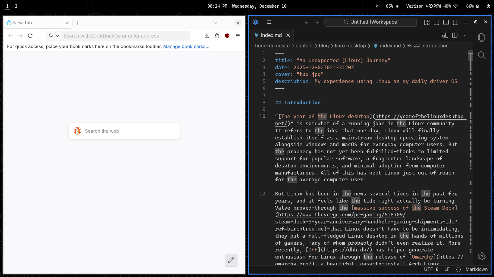

# Linux Desktop

Configuration files, applications, and setup for my Linux desktop.



## Installation

Execute scripts:

```sh
. setup.sh
```

```sh
. install.sh
```

```sh
. configs.sh
```

```sh
. post-setup.sh
```

Reboot the machine, then run:

```sh
. post-reboot.sh
```

## Packages

For a full list of installed packages, see `packages.arch.txt`, `packages.aur.txt`, and `packages.flatpak.txt`.

### Applications

- [Bitwarden](https://flathub.org/en/apps/com.bitwarden.desktop): Password manager
- [Blueberry](https://archlinux.org/packages/extra/any/blueberry/): Bluetooth device manager
- [Document Viewier (Evince)](https://wiki.archlinux.org/title/GNOME/Document_viewer): Gnome document viewer
- [Fedora Media Writer](https://flathub.org/en/apps/org.fedoraproject.MediaWriter): Tool for creating live USB drives
- [Flameshot](https://flathub.org/en/apps/org.flameshot.Flameshot): Screenshot utility
- [Gapless](https://flathub.org/en/apps/com.github.neithern.g4music): Music player
- [Ghostty](https://ghostty.org/): Terminal emulator
- [Gnome Boxes](https://archlinux.org/packages/extra/x86_64/gnome-boxes/): Virtual Machines
- [Gnome Calculator](https://archlinux.org/packages/extra/x86_64/gnome-calculator/): Calculator
- [Gnome Disk Utility](https://archlinux.org/packages/extra/x86_64/gnome-disk-utility/): Disk analyzer
- [LibreOffice](https://www.libreoffice.org/): Office suite
- [LibreWolf](https://librewolf.net/): Firefox without Mozilla spyware
- [LocalSend](https://localsend.org/): Airdrop alternative
- [mako](https://github.com/emersion/mako): Notifications
- [National Weather Service (Web App)](https://www.weather.gov/): Weather from the National Weather Service
- [Nautilus](https://apps.gnome.org/Nautilus/): File manager
- [Neovim](https://github.com/neovim/neovim): Text Editor
- [nwg-displays](https://github.com/nwg-piotr/nwg-displays): Display settings manager
- [MusicBrainz Picard](https://picard.musicbrainz.org/): Audio file metadata editor
- [Proton Calendar (Web App)](https://calendar.proton.me): Calendar
- [Proton Mail (Web App)](https://mail.proton.me): Email
- [pwvucontrol](https://flathub.org/en/apps/com.saivert.pwvucontrol): Audio settings
- [Signal](https://archlinux.org/packages/extra/x86_64/signal-desktop/): Signal client
- [Standard Notes](https://flathub.org/en/apps/org.standardnotes.standardnotes): Note taking
- [Ungoogled Chromium](https://github.com/ungoogled-software/ungoogled-chromium-archlinux): Chromium without Google spyware
- [VLC](https://www.videolan.org/vlc/): Media player
- [VSCodium](https://vscodium.com/d): VSCode without Miscroft spyware
- [Waypaper](https://github.com/anufrievroman/waypaper): Wallpaper manager
- [YouTube (Web App)](https://youtube.com): Videos

### Developer Tools

- Docker
- Go
- Node
- Python
- uv

## Installation Notes

### Graphics Drivers

Graphics drivers are not included in the package list. See the following pages for graphics drivers:

- [Nvidia](https://wiki.archlinux.org/title/NVIDIA)
- [AMD](https://wiki.archlinux.org/title/AMDGPU)

### Surface Book 2

During the Arch installation process, be sure to install [linux-firmware-marvell](https://archlinux.org/packages/core/any/linux-firmware-marvell/) as an additional package. This package is needed for the Marvell WiFi card.
