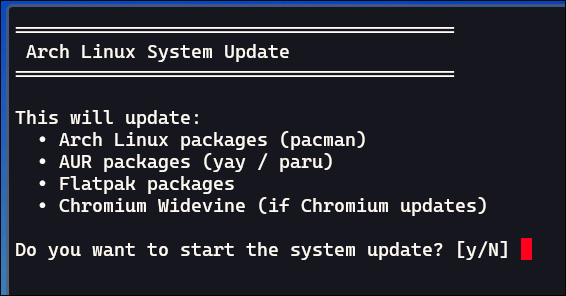

# Linux Desktop

Configuration files, applications, and setup for my Linux desktop. Tailored for my Lenovo Thinkpad T430.


## Installation

Execute scripts:

```sh
./setup.sh
```

```sh
./install.sh
```

```sh
./configs.sh
```

```sh
./post-setup.sh
```

Reboot the machine, then run:

```sh
./post-reboot.sh
```

## First Time Setup

Run `nwg-displays` (should appear as "Display Settings" in Fuzzel) and configure your display settings. Applying the display settings through `nwg-displays` will generate `~/.config/hypr/monitors.conf` with your display settings.

## Applications

- [Android File Transfer for Linux](https://whoozle.github.io/android-file-transfer-linux/): MTP client
- [Bitwarden](https://flathub.org/en/apps/com.bitwarden.desktop): Password manager
- [Blueman](https://github.com/blueman-project/blueman): Bluetooth device manager
- [Document Viewier (Evince)](https://wiki.archlinux.org/title/GNOME/Document_viewer): Gnome document viewer
- [Fedora Media Writer](https://flathub.org/en/apps/org.fedoraproject.MediaWriter): Tool for creating live USB drives
- [Gapless](https://flathub.org/en/apps/com.github.neithern.g4music): Music player
- [Gnome Boxes](https://archlinux.org/packages/extra/x86_64/gnome-boxes/): Virtual Machines
- [Gnome Calculator](https://archlinux.org/packages/extra/x86_64/gnome-calculator/): Calculator
- [Gnome Disk Utility](https://archlinux.org/packages/extra/x86_64/gnome-disk-utility/): Disk analyzer
- [Kitty](https://github.com/kovidgoyal/kitty): Terminal emulator
- [LibreOffice](https://www.libreoffice.org/): Office suite
- [LocalSend](https://localsend.org/): Airdrop alternative
- [Loupe](https://apps.gnome.org/Loupe/): Gnome image viewer
- [MusicBrainz Picard](https://picard.musicbrainz.org/): Audio file metadata editor
- [National Weather Service (Web App)](https://www.weather.gov/): Weather from the National Weather Service
- [Nautilus](https://apps.gnome.org/Nautilus/): File manager
- [Neovim](https://github.com/neovim/neovim): Text Editor
- [nwg-displays](https://github.com/nwg-piotr/nwg-displays): Display settings manager
- [Open Broadcaster Software (OBS)](https://obsproject.com/) - Screen recording
- [Proton Calendar (Web App)](https://calendar.proton.me): Calendar
- [Proton Mail (Web App)](https://mail.proton.me): Email
- [pwvucontrol](https://flathub.org/en/apps/com.saivert.pwvucontrol): Audio settings
- [Signal](https://archlinux.org/packages/extra/x86_64/signal-desktop/): Signal client
- [Standard Notes](https://flathub.org/en/apps/org.standardnotes.standardnotes): Note taking
- [Ungoogled Chromium](https://github.com/ungoogled-software/ungoogled-chromium-archlinux): Chromium without Google spyware
- [VLC](https://www.videolan.org/vlc/): Media player
- [VSCodium](https://vscodium.com/d): VSCode without Miscroft spyware
- [Waypaper](https://github.com/anufrievroman/waypaper): Wallpaper manager
- [YouTube (Web App)](https://youtube.com): Videos

## Developer Tools

- Docker
- Go
- Node
- pnpm
- Python
- uv

## Packages

For a full list of installed packages, see `packages.arch.txt`, `packages.aur.txt`, and `packages.flatpak.txt`.

## System Updater

Always use the "System Update" application in Fuzzel to update the system. This is a custom script that updates all Arch packages, AUR packages, and Flatpaks. Using this script ensures that `yay` does not break due to missed system updates. Additionally, this script downloads and installs the latest version of Google Widevine whenever Ungoogled Chromium is updated.



## Screenshot Utility

Use `Super + S` to take a screenshot.

## Troubleshooting

**Bluetooth Not Working**

If no devices are showing up in Blueman, check if `bluetooth.service` is enabled and running.

```sh
sudo systemctl status bluetooth.service
```

Enable and start it with:

```sh
sudo systemctl enable bluetooth.service
sudo systemctl start bluetooth.service
```
